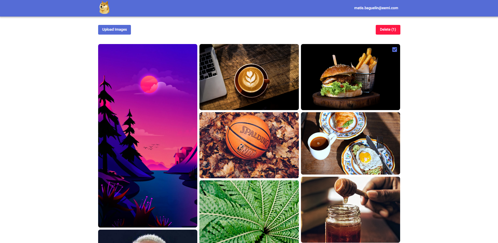

# Photo Gallery

Photo Gallery is a [Next.js](https://nextjs.org/) application that is a simplified version of Google Photos.



## Getting Started

Set up the environment variables:

```bash
# .env.local
NEXT_PUBLIC_SUPABASE_URL=
NEXT_PUBLIC_SUPABASE_ANON_KEY=
NEXT_PUBLIC_BUCKET_NAME=
```

Run the development server:

```bash
yarn install

yarn dev
```

## Usage

- Create an account or login to access your photo gallery.
- Upload images to the gallery.
- View your images in a grid layout.
- Click on an image to view it in full-screen mode.
- In full-screen mode, you can download or delete the image.

## Technologies Used

- [Next.js](https://nextjs.org/)
- [Supabase](https://supabase.com/): An open-source Firebase alternative.
- [Material-UI](https://mui.com/): A React UI library.
